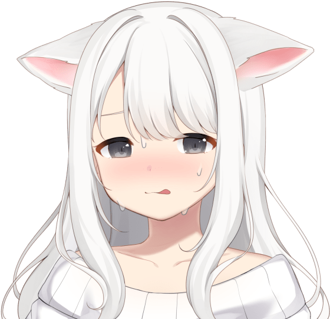

  

### อาโย่!

- 🍒 Name: **JK** 
- ⛏ Working  **DMC** 
- 🎨 bot developer in discord apprentice
- ✨ have basic knowledge in `JavaScript, C# Docker`, and so
- 🎭 most of the time I keep my practice stuff in my github privately.

### ประสบการณ์ที่กำลังจะเกิดขึ้น
- 🔭 **ruby backend api other**
- 🍞 **vue frontend web**
- 🍞 **fastify backend api**

### โปรเจค
- [Chat Talk Private](https://github.com/JKTheRipperTH/chat-g) `language c sharp`
- [Car Care](https://github.com/JKTheRipperTH/car-care) `language c sharp`
- [Portfolio](https://github.com/JKTheRipperTH/car-care) `language typesctipt`
- [System-Gang](https://github.com/JKTheRipperTH/System-Gang) `language javascript`

### สถิติ

### Discord

## เกี่ยวกับฉันใน github

